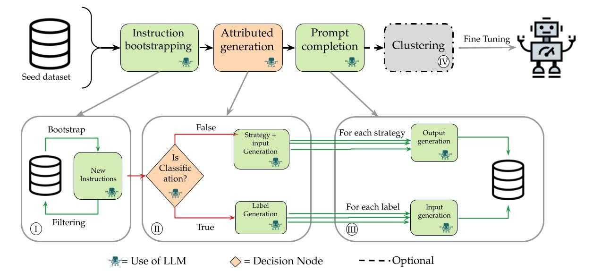

This repository contains a reimplementation and extension over the original [Self-Instruct paper](https://arxiv.org/abs/2212.10560), a method for aligning pretrained language models with instructions.

# Auto-Instruct

> Knowledge distillation through attributed instruction generation.

Auto-Instruct is a semi-automated instruction tuning pipeline that leverages large language models (LLMs), specifically GPT-4o, to generate a high-quality, diverse synthetic instructional dataset. It improves upon previous work (e.g., Self-Instruct) by introducing **attributed generation** and **knowledge distillation** mechanisms, achieving over 6× cost efficiency while preserving or enhancing dataset diversity and instructional quality.



## 🚀 Highlights

- **Attributed Instruction Generation**: Distinguishes between classification and non-classification tasks and augments them with labels or strategies, respectively.
- **Knowledge Distillation**: Uses a larger, instruction-tuned model (GPT-4o) to supervise the dataset generation for a smaller target model.
- **Stratified Sampling & Clustering**: Uses UMAP and Gaussian Mixtures to ensure balanced and diverse instruction distributions.
- **Cost Efficiency**: Reduces dataset creation cost to ~$80, compared to $500+ in comparable approaches.

## 📊 Dataset Statistics

| Phase                  | Unique Instructions | Total Instances | Avg. Labels (CLF) | Avg. Strategies (NON-CLF) |
|------------------------|---------------------|------------------|--------------------|----------------------------|
| Bootstrapping          | 10,000              | 10,000           | -                  | -                          |
| Attributed Generation  | 10,000              | 10,000           | 3.20               | 1.90                       |
| Prompt Completion      | 10,000              | 19,200           | 3.20               | 1.90                       |
| Final (Clustered 50k)  | 9,200               | 50,000           | 3.28               | 1.90                       |

## 🧠 Methodology

The generation pipeline is composed of four distinct phases:

1. **Instruction Bootstrapping**  
   - Starts from a seed dataset (175 examples)
   - Grows to 10k unique instructions via iterative prompting and filtering (ROUGE-L ≤ 0.7)

2. **Attributed Generation**  
   - Classifies instructions into CLF and NON-CLF
   - Generates labels for classification tasks
   - Generates strategies and input examples for open-ended tasks

3. **Prompt Completion**  
   - For CLF: Generates input per label
   - For NON-CLF: Generates outputs for each strategy

4. **Clustering and Stratified Sampling**  
   - UMAP + Gaussian Mixture Model to identify clusters
   - Stratified sampling to ensure balanced representation

## 📈 Evaluation

Human evaluation by 5 CS graduate students (50 instructions):

| Criterion                          | Self-Instruct | Auto-Instruct |
|-----------------------------------|---------------|---------------|
| Valid Task                        | 92%           | 96.2%         |
| Appropriate Input                 | 79%           | 84.6%         |
| Valid Strategy (if not empty)     | -             | 94.0%         |
| Correct Output                    | 58%           | 92.3%         |


## Additional detials

More details on the process can be found under docs/AUTO_INSTRUCT.pdf


## 🧪 Limitations

- Low classification task ratio (~2%)
- Ablation study confounded by model differences (GPT-3 vs GPT-4o)
- No fine-tuning results yet (future work planned)

## Citation

If you use the Auto-Instruct framework or data, feel free to cite the original Self-Instruct authors.

```bibtex
@misc{selfinstruct,
  title={Self-Instruct: Aligning Language Model with Self Generated Instructions},
  author={Wang, Yizhong and Kordi, Yeganeh and Mishra, Swaroop and Liu, Alisa and Smith, Noah A. and Khashabi, Daniel and Hajishirzi, Hannaneh},
  journal={arXiv preprint arXiv:2212.10560},
  year={2022}
}
```
